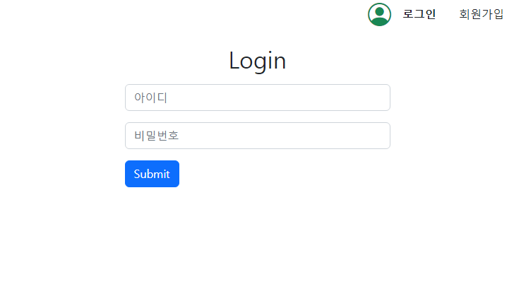
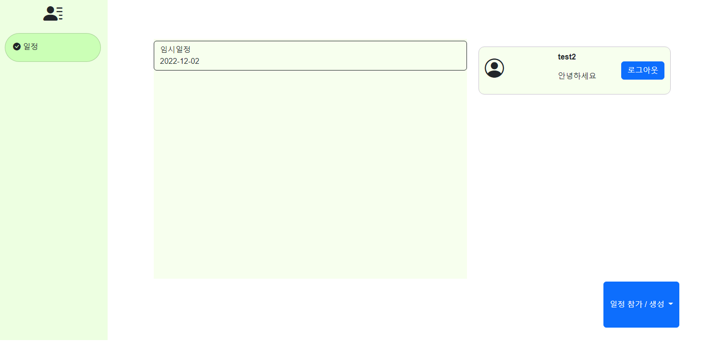
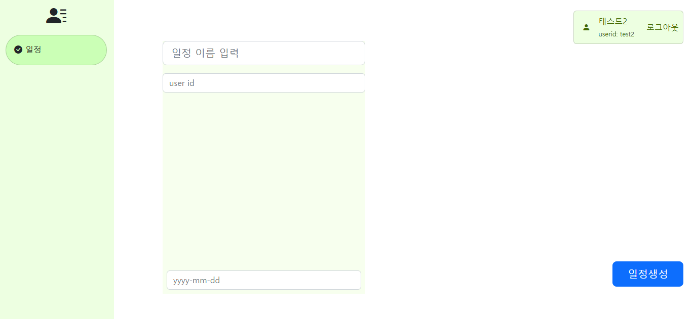

# MultiUser-Meeting-Scheduler

[](https://opensource.org/licenses/MIT)


## Purpose

This web aims to arrange each other's schedule, 
by input of each user's schedule.

Try our web to reach arrangement of available time!


## Requirement
```
- MySQL database
- Node
```


## How to use
Add this in `config/database.js`

```jsx
module.exports = {
    host     : hostip,
    user     : user,
    password : password
    database : name_of_database
};
```

`config/config.json`

```jsx
{
  "development": {
    "username": "root",
    "password": null,
    "database": "database_development",
    "host": "127.0.0.1",
    "dialect": "mysql",
      "port": 3306
  },
  "test": {
    "username": "root",
    "password": null,
    "database": "database_test",
    "host": "127.0.0.1",
    "dialect": "mysql",
      "port": 3306
  },
  "production": {
    "username": "root",
    "password": null,
    "database": "database_production",
    "host": "127.0.0.1",
    "dialect": "mysql",
      "port": 3306
  }
}
```

`.env`

```jsx
SECRET_KEY = yoursecretkey
JWT_SECRET = yourjwtsecret
PORT = portnum
```

Finally,
```
- npm install
- npm start
```

## Example


우선 로그인하거나 회원가입을 통해 계정을 생성합니다



현재 참여중인 일정의 목록이 보입니다   
우측의 참가/생성 버튼을 눌러 전달받은 일정id를 통해 참가하거나 일정을 생성할 수 있습니다.


일정 생성페이지에서 일정을 생성합니다


내가 참여중인 일정에 들어가면    
다음과 같이 좌측의 버튼을 통해 해당유저의 시간을 좌측 시간표에서 확인할 수 있으며   
우측에서 모든 참가자가 일정이 비는 시간을 바로 확인 할 수 있습니다


## Database Structure
### User

각 User의 개인정보를 저장합니다.

|  | Type |  | Comment |
| --- | --- | --- | --- |
| uid | string | primary | 유저 고유의 아이디 |
| password | string(40) | unique | 유저의 이름 |
| name | string | unique | 유저의 이메일 |

[](https://www.notion.so/fb8f3dacb9434b2eb24af50c645ea0d8)

### Schedule

시간표를 공유할 인원들이 속한 그룹 정보입니다.

|  | Type |  | Comment |
| --- | --- | --- | --- |
| id | int | auto_increment
primary |  |
| name | String | Unique |  |
| sched_day | Date |  | 날짜 |
| uid | String | Foreign Key | 스케줄 유저 |

### UserTimes

유저 일정의 시작 및 끝 시간을 정의합니다.

|  | Type |  | Comment |
| --- | --- | --- | --- |
| id | int | auto_increment |  |
| userid | int |  |  |
| groupid | int |  |  |
| startTime | hh:mm |  |  |
| endTime | hh:mm |  |  |

### UserSchedule
Linked Table Between User - Schedule

### API Structure

Link : https://navy-sting-049.notion.site/APIs-7aa8d40df52b42b4baf65dcd07bd4f2e

## Youtube link
https://youtu.be/ReUuH3mMbYc